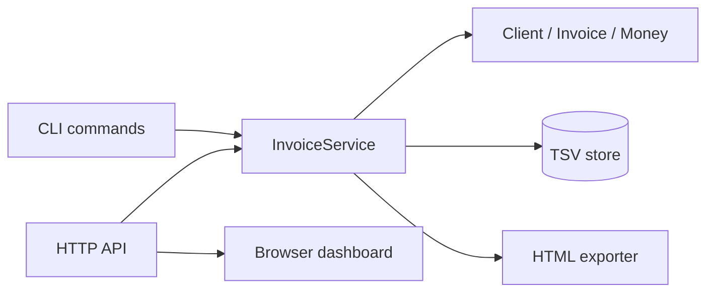

# InvoicePilot

InvoicePilot is a serious object-oriented Java invoicing web app for freelancers and small businesses. It includes a browser dashboard, local storage, invoice calculations, status tracking, printable HTML invoice export, and a CLI for power users.

The project is intentionally dependency-free so it can build with plain `javac` and `java`.

## Features

- Object-oriented domain model: `Client`, `Invoice`, `LineItem`, `Money`, `InvoiceStatus`
- Java web app powered by the built-in JDK HTTP server
- Browser dashboard for clients, invoices, line items, status, and export
- Local file storage using a simple TSV data file
- Add and list clients
- Create invoices
- Add invoice items
- Calculate subtotal, tax, discount, and total
- Mark invoices sent or paid
- Export printable HTML invoices
- Lightweight Java test runner

## Build

From the project root:

```powershell
.\scripts\build.ps1
```

## Run

```powershell
.\scripts\run.ps1 help
```

## Start The Web App

```powershell
.\scripts\build.ps1
.\scripts\web.ps1
```

Then open:

```text
http://localhost:8080
```

## Example Workflow

```powershell
.\scripts\run.ps1 add-client --name "Amina Lee" --email "amina@example.com" --company "Amina Studio"

.\scripts\run.ps1 list-clients

.\scripts\run.ps1 create-invoice --client CLIENT_ID --number INV-001 --due 2030-01-31 --tax 0.16 --currency USD

.\scripts\run.ps1 add-item --invoice INVOICE_ID --description "Website design" --quantity 1 --price 900 --currency USD

.\scripts\run.ps1 mark-sent --invoice INVOICE_ID

.\scripts\run.ps1 show --invoice INVOICE_ID

.\scripts\run.ps1 export-html --invoice INVOICE_ID --out exports/invoice.html
```

Replace `CLIENT_ID` and `INVOICE_ID` with values printed by earlier commands.

## Test

```powershell
.\scripts\test.ps1
```

Expected:

```text
All InvoicePilot tests passed
```

## Architecture



```text
cli/        command-line application
domain/     core OOP business model
service/    use-case layer
storage/    local persistence
export/     printable invoice output
web/        HTTP API and web server
resources/  browser UI
```

## Design Trade-offs

- Plain Java and the JDK HTTP server keep the project dependency-free and easy to audit, at the cost of fewer framework conveniences.
- TSV storage is transparent and portable for a small-business MVP, but should be replaced by a transactional database for concurrent production workloads.
- Domain objects own invoice calculations and status transitions so the CLI and HTTP adapters share the same business rules.

## API Contract

The web adapter exposes JSON endpoints including `POST /api/clients`, `GET /api/summary`, invoice creation and status commands, plus static HTML under `/`. CLI commands mirror these use cases: `add-client`, `create-invoice`, `add-item`, `mark-sent`, `show`, and `export-html`.

## Author

NIGHTJAS50
